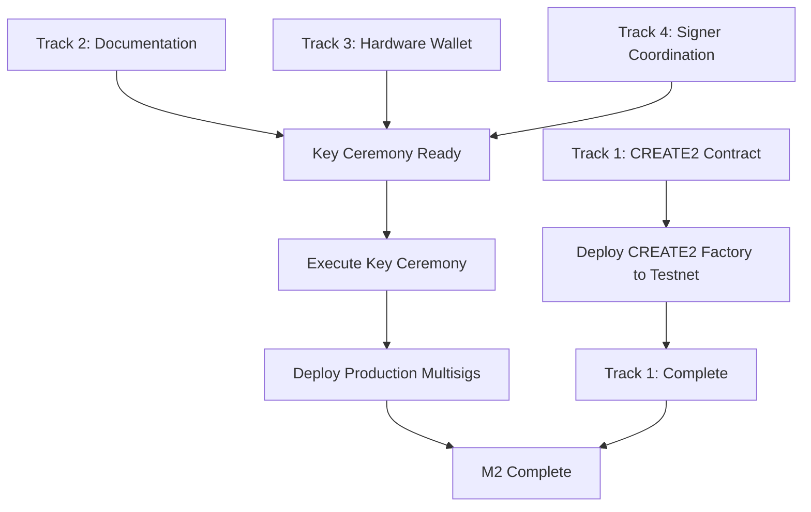

# M2 Parallel Development Plan

**Milestone**: Deterministic Deployment & Key Management (v1.1.0)
**Status**: In Progress
**Target**: Q1 2025

## Analysis of Parallel Development Opportunities

Based on M2 deliverables, I've identified **4 parallel development tracks** that can be worked on simultaneously with minimal dependencies.

---

## 🔀 Parallel Development Tracks

### Track 1: CREATE2 Infrastructure (Technical - High Priority)
**Team**: Smart Contract Developers
**Dependencies**: None (can start immediately)
**Estimated Duration**: 2-3 weeks

#### Tasks
1. **CREATE2 Factory Contract Development**
   - Design CREATE2Factory.sol contract
   - Implement deterministic deployment logic
   - Add salt generation mechanism
   - Include address pre-computation functions
   - Add deployment verification helpers

2. **Deployment Script Updates**
   - Modify existing deployment scripts to use CREATE2
   - Add salt generation utilities
   - Implement pre-deployment address verification
   - Add post-deployment bytecode verification
   - Create cross-chain deployment orchestration

3. **Testing Suite**
   - Unit tests for CREATE2 factory
   - Integration tests for deployment scripts
   - Cross-chain consistency tests
   - Bytecode verification tests

#### Deliverables
- `contracts/CREATE2Factory.sol`
- `scripts/deploy-create2.ts`
- `scripts/verify-deployment.ts`
- `test/CREATE2Factory.test.ts`
- Documentation on deterministic deployment

#### Can Start Immediately: ✅ YES
**No blockers** - This is pure technical implementation

---

### Track 2: Documentation & Procedures (Non-Technical - High Priority)
**Team**: Technical Writers / Security Engineers
**Dependencies**: None (can start immediately)
**Estimated Duration**: 1-2 weeks

#### Tasks
1. **Multisig Configuration Documentation**
   - Document Gnosis Safe setup procedures
   - Create step-by-step multisig deployment guide
   - Document signature threshold configurations
   - Create multisig testing procedures
   - Document ownership transfer workflows

2. **Key Ceremony Documentation**
   - Draft key ceremony protocol
   - Create pre-ceremony checklist
   - Document ceremony execution steps
   - Create post-ceremony verification procedures
   - Document witness requirements

3. **Emergency Response Playbook**
   - Document emergency pause procedures
   - Create incident response workflows
   - Define escalation paths
   - Document communication protocols
   - Create emergency contact lists (templates)

4. **Key Management Runbook**
   - Document key hierarchy (Levels 1-4)
   - Create key rotation procedures
   - Document backup and recovery processes
   - Define geographic distribution requirements
   - Create hardware wallet setup guides

5. **Signer Onboarding Guide**
   - Create signer responsibility documentation
   - Document hardware wallet requirements
   - Create training materials
   - Define signer vetting procedures
   - Document offboarding procedures

#### Deliverables
- `docs/multisig-setup.md`
- `docs/key-ceremony.md`
- `docs/emergency-response-playbook.md`
- `docs/key-management-runbook.md`
- `docs/signer-onboarding.md`

#### Can Start Immediately: ✅ YES
**No blockers** - These are procedural documents that can be drafted independently

---

### Track 3: Hardware Wallet Integration (Technical - Medium Priority)
**Team**: DevOps / Security Engineers
**Dependencies**: Minimal (needs basic CREATE2 design, not implementation)
**Estimated Duration**: 1-2 weeks

#### Tasks
1. **Hardware Wallet Setup**
   - Research Ledger vs Trezor compatibility
   - Test hardware wallet integration with Hardhat
   - Document connection procedures
   - Create air-gapped signing workflows
   - Test with testnet deployments

2. **Deployment Workflow with Hardware Wallets**
   - Integrate hardware wallet with deployment scripts
   - Create transaction verification procedures
   - Document signing workflows
   - Test emergency procedures with hardware wallets
   - Create backup/recovery procedures

3. **Testing & Validation**
   - Test hardware wallet signing on testnet
   - Validate transaction creation
   - Test multisig operations with hardware wallets
   - Document common issues and solutions

#### Deliverables
- `scripts/deploy-hardware-wallet.ts`
- `docs/hardware-wallet-setup.md`
- `docs/hardware-wallet-troubleshooting.md`
- Working hardware wallet deployment demo

#### Can Start Immediately: ⚠️ PARTIAL
**Minimal blocker** - Can start research and setup while CREATE2 is being developed
**Parallel Start**: 80% of work can begin immediately

---

### Track 4: Multisig Infrastructure Setup (Operational - Medium Priority)
**Team**: Project Managers / Operations
**Dependencies**: Requires signer identification (human coordination)
**Estimated Duration**: 2-4 weeks (due to coordination overhead)

#### Tasks
1. **Signer Identification & Vetting**
   - Identify Level 2 signers (3 people for 2-of-3)
   - Identify Level 3 signers (5 people for 3-of-5)
   - Identify Level 4 signers (3 people for 1-of-3)
   - Conduct background checks (if required)
   - Obtain commitments from all signers

2. **Hardware Wallet Procurement**
   - Purchase Ledger/Trezor devices for all signers
   - Distribute to geographically distributed locations
   - Ensure secure shipping/handling
   - Verify receipt by all signers

3. **Pre-Ceremony Preparation**
   - Schedule key ceremony date/time
   - Prepare secure environment (if in-person)
   - Set up secure communication channels (if remote)
   - Prepare witness requirements
   - Document all participants

4. **Testnet Multisig Deployment**
   - Deploy Gnosis Safe on Base Sepolia
   - Deploy Gnosis Safe on Ethereum Sepolia
   - Test signature flows with all signers
   - Validate threshold configurations
   - Test emergency procedures

#### Deliverables
- Confirmed signer roster for all 4 levels
- Hardware wallets distributed
- Testnet multisigs deployed and tested
- Key ceremony scheduled
- Pre-ceremony documentation complete

#### Can Start Immediately: ⚠️ PARTIAL
**Human coordination blocker** - Requires identifying and coordinating with people
**Parallel Start**: Signer identification can begin immediately (50% of work)

---

## 📊 Dependency Analysis

### Critical Path Dependencies



### What Can Start Right Now (No Dependencies)

✅ **Track 1**: CREATE2 contract development
✅ **Track 2**: All documentation work
✅ **Track 3**: Hardware wallet research and setup (80%)
✅ **Track 4**: Signer identification (50%)

### What Requires Completion First

⏳ **Key Ceremony Execution** requires:
- Track 2: Documentation complete
- Track 3: Hardware wallets distributed
- Track 4: All signers identified and ready

⏳ **Production Deployment** requires:
- Track 1: CREATE2 factory deployed to all chains
- Key ceremony complete
- All multisigs set up

---

## 🎯 Recommended Parallel Execution Plan

### Week 1-2: Maximum Parallelization
**Start ALL tracks simultaneously:**

| Track | Activity | Team |
|-------|----------|------|
| Track 1 | Design CREATE2Factory.sol | Smart Contract Devs |
| Track 2 | Write all documentation | Technical Writers |
| Track 3 | Research hardware wallets, set up dev environment | DevOps |
| Track 4 | Identify signers, start vetting | Project Manager |

**Expected Output**:
- CREATE2 contract designed
- 80% of documentation drafted
- Hardware wallet integration tested on testnet
- All signers identified

### Week 3-4: Integration Phase
**Bring tracks together:**

| Track | Activity | Team |
|-------|----------|------|
| Track 1 | Implement CREATE2 deployment scripts | Smart Contract Devs |
| Track 2 | Finalize documentation based on Track 1 progress | Technical Writers |
| Track 3 | Integrate hardware wallets with CREATE2 scripts | DevOps |
| Track 4 | Procure and distribute hardware wallets | Ops Team |

**Expected Output**:
- CREATE2 factory complete with tests
- All documentation finalized
- Hardware wallet deployment workflow ready
- Hardware wallets in signers' hands

### Week 5-6: Testing & Ceremony
**Sequential completion:**

1. Deploy CREATE2 factory to testnets (Track 1)
2. Deploy multisigs to testnets using hardware wallets (Track 3 + 4)
3. Test all procedures with documentation (Track 2)
4. Schedule and execute key ceremony (All Tracks)

**Expected Output**:
- M2 deliverables complete
- Ready for M3 (Testnet Deployment)

---

## 🚀 Quick Start Actions (Next 48 Hours)

### Immediate Actions (Can Do Now)

#### For Smart Contract Developers:
1. Create new branch: `feat/create2-factory`
2. Start designing `CREATE2Factory.sol` contract
3. Review existing deployment scripts in `scripts/deploy.ts`
4. Set up test file: `test/CREATE2Factory.test.ts`

```bash
git checkout -b feat/create2-factory
touch contracts/CREATE2Factory.sol
touch test/CREATE2Factory.test.ts
```

#### For Technical Writers:
1. Create documentation branch: `docs/m2-procedures`
2. Create documentation structure:

```bash
git checkout -b docs/m2-procedures
mkdir -p docs/procedures
touch docs/procedures/multisig-setup.md
touch docs/procedures/key-ceremony.md
touch docs/procedures/emergency-response.md
touch docs/procedures/key-management.md
touch docs/procedures/signer-onboarding.md
```

3. Start drafting based on ROADMAP.md details

#### For DevOps Engineers:
1. Create branch: `feat/hardware-wallet-integration`
2. Research hardware wallet plugins for Hardhat:
   - `@ledgerhq/hw-app-eth`
   - Hardhat ledger plugin
   - Trezor integration options

```bash
git checkout -b feat/hardware-wallet-integration
npm install --save-dev @ledgerhq/hw-app-eth
```

3. Create test deployment script

#### For Project Managers:
1. Create signer identification spreadsheet
2. Define signer requirements:
   - Technical competence
   - Geographic distribution
   - Availability
   - Security clearance (if needed)
3. Start reaching out to potential signers
4. Create GitHub issues for tracking:
   - "Identify Level 2 Admin Signers (2-of-3)"
   - "Identify Level 3 Treasury Signers (3-of-5)"
   - "Identify Level 4 Emergency Signers (1-of-3)"

---

## 📋 GitHub Issues to Create

Create these issues now and assign to milestones:

### Track 1: CREATE2 Infrastructure
- [ ] Issue: "Design and implement CREATE2Factory.sol contract" (M2, Priority:CRITICAL, feat., back-end)
- [ ] Issue: "Update deployment scripts to use CREATE2" (M2, Priority:CRITICAL, devops)
- [ ] Issue: "Implement salt generation and address pre-computation" (M2, Priority:HIGH, feat., back-end)
- [ ] Issue: "Add bytecode verification to deployment process" (M2, Priority:HIGH, devops)
- [ ] Issue: "Create CREATE2 factory test suite" (M2, Priority:HIGH, back-end)

### Track 2: Documentation
- [ ] Issue: "Write multisig setup documentation" (M2, Priority:HIGH, documentation)
- [ ] Issue: "Draft key ceremony protocol documentation" (M2, Priority:CRITICAL, documentation)
- [ ] Issue: "Create emergency response playbook" (M2, Priority:CRITICAL, documentation)
- [ ] Issue: "Write key management runbook" (M2, Priority:HIGH, documentation)
- [ ] Issue: "Create signer onboarding guide" (M2, Priority:MEDIUM, documentation)

### Track 3: Hardware Wallet Integration
- [ ] Issue: "Research and select hardware wallet solution" (M2, Priority:HIGH, devops)
- [ ] Issue: "Integrate hardware wallet with Hardhat deployment" (M2, Priority:HIGH, devops, feat.)
- [ ] Issue: "Create hardware wallet setup guide" (M2, Priority:MEDIUM, documentation, devops)
- [ ] Issue: "Test hardware wallet deployment on testnet" (M2, Priority:HIGH, devops)

### Track 4: Multisig Infrastructure
- [ ] Issue: "Identify and vet Level 2 Admin signers (2-of-3)" (M2, Priority:CRITICAL, project-manager)
- [ ] Issue: "Identify and vet Level 3 Treasury signers (3-of-5)" (M2, Priority:CRITICAL, project-manager)
- [ ] Issue: "Identify and vet Level 4 Emergency signers (1-of-3)" (M2, Priority:HIGH, project-manager)
- [ ] Issue: "Procure hardware wallets for all signers" (M2, Priority:HIGH, project-manager)
- [ ] Issue: "Deploy and test Gnosis Safe multisigs on testnet" (M2, Priority:HIGH, devops)
- [ ] Issue: "Schedule key ceremony" (M2, Priority:CRITICAL, project-manager)

---

## 🎓 Resource Allocation

### Minimum Team Requirements

| Role | Count | Allocation | Primary Track |
|------|-------|------------|---------------|
| Smart Contract Developer | 1-2 | Full-time (2 weeks) | Track 1 |
| Technical Writer | 1 | Part-time (1 week) | Track 2 |
| DevOps Engineer | 1 | Part-time (1-2 weeks) | Track 3 |
| Project Manager | 1 | Part-time (ongoing) | Track 4 |
| Security Reviewer | 1 | Part-time (review) | All Tracks |

### Solo Developer Approach

If working solo, prioritize:
1. **Week 1**: Track 1 (CREATE2 contract) - 100% time
2. **Week 2**: Track 2 (Documentation) - 60% time, Track 1 (Testing) - 40% time
3. **Week 3**: Track 3 (Hardware wallet) - 50% time, Track 4 (Coordination) - 50% time
4. **Week 4**: Integration and testing - 100% time

---

## ✅ Success Metrics

Track progress with these metrics:

### Track 1: CREATE2 Infrastructure
- [ ] CREATE2Factory.sol written and tested (100% coverage)
- [ ] Deployment scripts updated and tested on testnet
- [ ] Same addresses achieved on Base Sepolia + Ethereum Sepolia
- [ ] Bytecode verification automated
- [ ] Documentation for CREATE2 deployment complete

### Track 2: Documentation
- [ ] 5 documentation files complete and reviewed
- [ ] Key ceremony protocol approved by security team
- [ ] Emergency procedures tested in tabletop exercise
- [ ] All signers trained on procedures

### Track 3: Hardware Wallet
- [ ] Hardware wallet integration working on testnet
- [ ] At least 2 hardware wallet brands tested
- [ ] Air-gapped signing demonstrated
- [ ] Troubleshooting guide created

### Track 4: Multisig Infrastructure
- [ ] All 11 signers identified (3+5+3)
- [ ] All hardware wallets distributed
- [ ] Testnet multisigs deployed and tested
- [ ] Key ceremony completed successfully
- [ ] Production multisigs deployed and verified

---

## 🚧 Risk Mitigation

### Track 1 Risks
**Risk**: CREATE2 factory complexity
**Mitigation**: Use battle-tested CREATE2 patterns, extensive testing

**Risk**: Cross-chain address mismatch
**Mitigation**: Automated verification scripts, testnet validation first

### Track 2 Risks
**Risk**: Documentation becomes outdated
**Mitigation**: Version control, review after implementation changes

### Track 3 Risks
**Risk**: Hardware wallet compatibility issues
**Mitigation**: Test multiple brands early, have fallback options

### Track 4 Risks
**Risk**: Signer availability/dropout
**Mitigation**: Identify backup signers, flexible ceremony scheduling

**Risk**: Geographic coordination challenges
**Mitigation**: Support both in-person and remote ceremonies

---

## 📅 Timeline Summary

```
Week 1-2:  ████████████████████ (All 4 tracks in parallel - Design & Draft)
Week 3-4:  ████████████████████ (All 4 tracks in parallel - Implementation)
Week 5:    ██████████░░░░░░░░░░ (Sequential - Testnet deployment & testing)
Week 6:    ██████████░░░░░░░░░░ (Sequential - Key ceremony & production setup)
```

**Total Duration**: 4-6 weeks with proper parallelization
**Without Parallelization**: 8-12 weeks

**Time Saved**: 50%+ through parallel development

---

## 🎯 Next Steps

1. **Review this plan** with the team
2. **Create GitHub issues** for all tracks
3. **Assign team members** to tracks
4. **Set up parallel branches** for each track
5. **Schedule weekly sync** to coordinate across tracks
6. **Begin Track 1 and Track 2 immediately** (no blockers)

---

**Document Version**: 1.0
**Created**: December 21, 2024
**Next Review**: After Week 2 (track progress and adjust)

See [ROADMAP.md](ROADMAP.md) for full milestone details and [CHANGELOG.md](CHANGELOG.md) for progress tracking.
